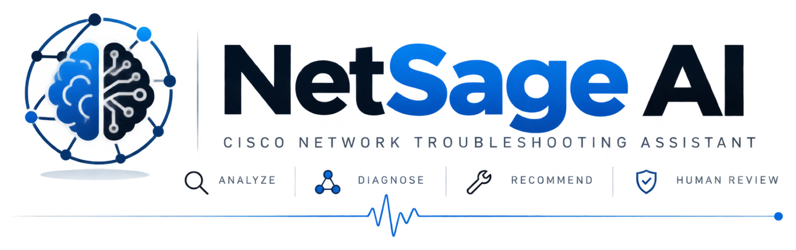

<div align="center">

# NetSage AI



### AI-Powered Cisco Network Troubleshooting

<p>
  Diagnose network faults from Cisco Packet Tracer evidence using
  <b>Python</b>, <b>rule-based analysis</b>, and <b>LLMs</b>.
</p>

<p>
  <a href="backend/docs/ARCHITECTURE.md">ARCHITECTURE</a>
  ·
  <a href="backend/docs/API_REFERENCE.md">API REFERENCE</a>
  ·
  <a href="backend/docs/VSCODE_SETUP.md">QUICK START</a>
  ·
  <a href=backend/"docs/TESTING.md">EVALUATION</a>
  ·
  <a href="backend/docs/TROUBLESHOOTING.md">TROUBLESHOOTING</a>
</p>

<p>
  
  
  
  
  
  
</p>

</div>

> **AI-assisted troubleshooter for Cisco Packet Tracer labs. Analyzes symptoms & show-command output, suggests root cause with confidence, and requires human review before accepting any fix.**

---

## Quick Start

```bash
cd backend

# 1. Install deps
python -m venv .venv && .venv\Scripts\activate && pip install -r requirements.txt

# 2. Configure API keys
cp .env.example .env  # Add OPENROUTER_API_KEY

# 3. CLI mode
python main_cli.py

# 4. Web UI (FastAPI + templates)
python main.py          # http://localhost:8000

# 5. Run tests
$env:PYTHONPATH="."; pytest tests/ -v
```

---

## Project Structure

```
Cisco_project/
├── backend/                    # FastAPI + CLI
│   ├── main.py                 # FastAPI server (port 8000)
│   ├── main_cli.py             # CLI (8 commands)
│   ├── requirements.txt
│   ├── .env / .env.example
│   ├── data/                   # 30 cases, evidence, dashboard, review log
│   ├── docs/                   # Full docs + prompt library
│   ├── scripts/                # validate.py, test_integration.py
│   ├── src/ (10 modules)       # config, models, data_loader, evidence_parser,
│   │                            rule_checker, diagnosis, llm_client, prompts,
│   │                            human_review, dashboard, evaluator, utils
│   └── tests/ (15 tests)
├── frontend/                   # Web UI
│   ├── static/css, js, data/
│   └── templates/              # base, index, diagnose, cases, review, dashboard
└── README.md
```

---

## Features

| Category | Details |
|----------|---------|
| **30 Fault Categories** | IP, VLAN, DHCP, DNS, Routing, ACL, NAT, Wireless |
| **Rule Checker** | 10 deterministic checks (runs before AI) |
| **AI Pipeline** | Keyword filter → Structured prompt → LLM → JSON |
| **Human Review** | Accepted / Edited / Rejected + Markdown log |
| **Dashboard** | HTML + Chart.js (stats, charts, tables) |
| **Prompt Library** | `diagnose_prompt.md` with 3 worked examples |
| **API** | 15 endpoints + WebSocket |

---

## CLI Commands (main_cli.py)

| # | Command | Description |
|---|---------|-------------|
| 1 | List Cases | All 30 faults with concept & severity |
| 2 | Diagnose | Rule checker → AI → human review prompt |
| 3 | Validate | CSV integrity check |
| 4 | Evaluate | Batch accuracy report |
| 5 | Review Log | Accepted/Edited/Rejected stats |
| 6 | Dashboard | Generate & open HTML |
| 7 | Rule Check | Deterministic checks on case |
| 8 | Exit | Quit |

---

## API Endpoints (main.py)

| Endpoint | Method | Description |
|----------|--------|-------------|
| `/` `/dashboard` `/diagnose` `/cases` `/review` | GET | Web pages |
| `/api/health` | GET | Health check |
| `/api/cases` `/api/cases/{id}` | GET | List / get case + evidence |
| `/api/diagnose` | POST | AI diagnosis |
| `/api/rule-check` | POST | Deterministic checks |
| `/api/review` `/api/review/stats` | POST/GET | Human review |
| `/api/dashboard/data` | GET | Dashboard JSON |
| `/api/evaluate` `/api/validate` | POST/GET | Evaluation |
| `/ws` | WS | Real-time updates |

---

## Evidence Format (`data/evidence/case_XX.txt`)

```text
[user_description]
PC1 cannot reach PC2. Same switch. Wrong IP subnet.

[ping_results]
Pinging 192.168.1.20: Request timed out (4/4)

[ipconfig]
IPv4 Address: 192.168.2.10
Subnet Mask: 255.255.255.0
Default Gateway: 0.0.0.0

[show_ip_interface_brief]
GigabitEthernet0/0 192.168.1.1 up up

[show_running_config]
interface FastEthernet0/1
 switchport mode access
 switchport access vlan 10
```

---

## Human Review Workflow

After diagnosis → prompted: **Accepted / Edited / Rejected**  
Logged to `data/human_review_log.md` with AI output + human corrections.  
**Requirement:** ≥5 corrected cases (Edited/Rejected).

---

## Documentation

See **[backend/docs/README.md](backend/docs/README.md)** for complete documentation including:

- Full installation & configuration
- All 30 fault categories table
- Architecture diagrams
- Rule checker details (10 checks)
- Prompt library with 3 worked examples
- Evaluation methodology
- Responsible AI compliance
- Troubleshooting guide
- VS Code setup guide

---

## VS Code Setup

```json
// .vscode/settings.json
{
  "python.defaultInterpreterPath": "${workspaceFolder}/backend/.venv/Scripts/python.exe",
  "python.testing.pytestEnabled": true,
  "python.testing.pytestArgs": ["tests"],
  "editor.formatOnSave": true,
  "python.linting.enabled": true,
  "python.linting.pylintEnabled": true
}
```

```json
// .vscode/launch.json
{
  "configurations": [
    {"name": "FastAPI Server", "type": "python", "request": "launch",
     "module": "uvicorn", "args": ["main:app", "--reload", "--port", "8000"],
     "cwd": "${workspaceFolder}/backend"},
    {"name": "CLI", "type": "python", "request": "launch",
     "module": "main_cli", "cwd": "${workspaceFolder}/backend"},
    {"name": "Pytest", "type": "python", "request": "launch",
     "module": "pytest", "args": ["tests", "-v"], "cwd": "${workspaceFolder}/backend"}
  ]
}
```

---

## Key Files

| File | Purpose |
|------|---------|
| `backend/src/rule_checker.py` | 10 deterministic checks |
| `backend/src/diagnosis.py` | Pipeline: Rules → Filter → LLM |
| `backend/src/llm_client.py` | OpenRouter + fallback models |
| `backend/src/human_review.py` | Accepted/Edited/Rejected workflow |
| `backend/src/dashboard.py` | HTML + Chart.js generator |
| `backend/diagnose_prompt.md` | System prompt + 3 examples |
| `frontend/templates/*.html` | 5 web pages |
| `backend/docs/diagnose_prompt.md` | Prompt library |

---

## Testing

```bash
cd backend
$env:PYTHONPATH="."; pytest tests/ -v
# 15 tests: data_loader(5), diagnosis(5), evaluator(5)
```

---

## Requirements

- Python 3.11+
- OpenRouter API key (free tier at openrouter.ai)
- Dependencies: `fastapi`, `uvicorn`, `pydantic`, `pandas`, `openai`, `google-genai`, `jinja2`, `chart.js` (CDN)

---

## License

Educational project for Cisco networking + AI integration. Not for production use.

---

**Built for:** Applied AI + Network Troubleshooting (NetSage AI)  
**Safety Rule:** Human review required for every diagnosis
